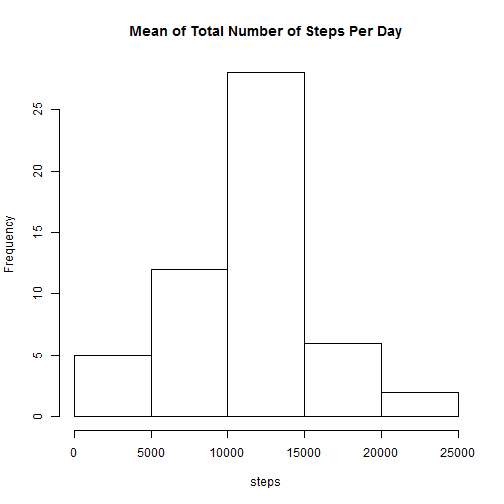
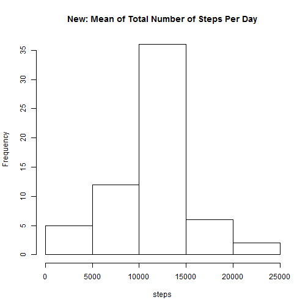

# Peer-graded Assignment: Course Project 1


### Data
This assignment makes use of data from a personal activity monitoring device. This device collects data at 5 minute intervals through out the day. The data consists of two months of data from an anonymous individual collected during the months of October and November, 2012 and include the number of steps taken in 5 minute intervals each day.

### Variables
The variables included in this dataset are:

1. steps: Number of steps taking in a 5-minute interval (missing values are coded as NA)???????)
2. ate: The date on which the measurement was taken in YYYY-MM-DD format
in3. terval: Identifier for the 5-minute interval in which measurement was taken

### Loading and preprocessing the data

```r
path<-setwd("D:\\Reproducible Research")

library(downloader)
fileurl<-"https://d396qusza40orc.cloudfront.net/repdata%2Fdata%2Factivity.zip"
download.file(fileurl,destfile="./courseproject.zip")
unzip("courseproject.zip")

library(data.table)
data_raw <- read.table("./activity.csv",sep=",",header=TRUE)
head(data_raw)
```

```
##   steps       date interval
## 1    NA 2012-10-01        0
## 2    NA 2012-10-01        5
## 3    NA 2012-10-01       10
## 4    NA 2012-10-01       15
## 5    NA 2012-10-01       20
## 6    NA 2012-10-01       25
```

### What is mean total number of steps taken per day
For this part of the assignment, you can ignore the missing values in the dataset.

1. Calculate the total number of steps taken per day

```r
data_step<-aggregate(steps ~ date, data_raw, sum)
```

2. If you do not understand the difference between a histogram and a barplot, research the difference between them. Make a histogram of the total number of steps taken each day

```r
hist(data_step$steps,main="Mean of Total Number of Steps Per Day",xlab="steps")
```



3. Calculate and report the mean and median of the total number of steps taken per day

```r
step_mean<-mean(data_step$steps)
step_median<-median(data_step$steps)
step_mean
```

```
## [1] 10766.19
```

```r
step_median
```

```
## [1] 10765
```
The mean of steps taken per day is 10766 steps and the median of steps taken per day is 10765 steps.

### What is the average daily activity pattern?
1. Make a time series plot (i.e.TYPE="l") of the 5-minute interval (x-axis) and the average number of steps taken, averaged across all days (y-axis)

```r
data_stepbyinterval<-aggregate(steps ~ interval, data_raw, mean)
with(data_stepbyinterval,plot(steps~interval,main="Avg Step Per Day by Interval",type="l"),width=480,height=480)
```


2. Which 5-minute interval, on average across all the days in the dataset, contains the maximum number of steps?

```r
data_stepbyinterval[which.max(data_stepbyinterval$steps),]
```

```
##     interval    steps
## 104      835 206.1698
```
The 835th interval contains the maximum number of steps, which is 206 steps.

### Imputing missing values
Note that there are a number of days/intervals where there are missing values (coded as ????????). The presence of missing days may introduce bias into some calculations or summaries of the data.

1. Calculate and report the total number of missing values in the dataset (i.e. the total number of rows with ????????s)

```r
sum(is.na(data_raw))
```

```
## [1] 2304
```
There are 2304 missing values.

2. Devise a strategy for filling in all of the missing values in the dataset. The strategy does not need to be sophisticated. For example, you could use the mean/median for that day, or the mean for that 5-minute interval, etc.
3. Create a new dataset that is equal to the original dataset but with the missing data filled in.

```r
data_New <- data_raw 
data_New$avgSteps<-data_stepbyinterval$steps
for (x in 1:nrow(data_New)) {
    if (is.na(data_New$steps[x])) {
        data_New$steps[x] <- data_New[which(data_New$interval[x] == data_stepbyinterval$interval), ]$avgSteps}}
sum(is.na(data_New))
```

```
## [1] 0
```
The methodology is to find the missing value and replace it with the average number of steps in that particular interval.

4. Make a histogram of the total number of steps taken each day and Calculate and report the mean and median total number of steps taken per day. Do these values differ from the estimates from the first part of the assignment?     What is the impact of imputing missing data on the estimates of the total daily number of steps?

```r
data_step_New<-aggregate(steps ~ date, data_New, sum)
sum(data_New$steps)
```

```
## [1] 656737.5
```

```r
hist(data_step_New$steps,main="New: Mean of Total Number of Steps Per Day",xlab="steps")
```



```r
step_mean_new<-mean(data_step_New$steps)
step_median_new<-median(data_step_New$steps)
step_mean_new
```

```
## [1] 10766.19
```

```r
step_median_new
```

```
## [1] 10766.19
```

```r
mean_diff<-step_mean_new - step_mean
median_diff<-step_median_new - step_median
mean_diff
```

```
## [1] 0
```

```r
median_diff
```

```
## [1] 1.188679
```
The means are the same for imputed & nonimputed data. However, the median for the nonimupted data is 1.188679 smaller than imputed data.
Thus,the impact of the imputed data for the total daily number of steps are: imputed data has 86129 more steps than the nonimputed data.

```r
step_total_new<-sum(data_step_New$steps)-sum(data_step$steps)
step_total_new
```

```
## [1] 86129.51
```

### Are there differences in activity patterns between weekdays and weekends?

For this part the Weekdays() function may be of some help here. Use the dataset with the filled-in missing values for this part.

1. Create a new factor variable in the dataset with two levels - "weekday" and "weekend" indicating whether a given date is a weekday or weekend day.

```r
data_New$Weekflag<-weekdays(as.Date(data_New$date))
data_New$Weekflag<-ifelse(data_New$Weekflag %in% c("Monday","Tuesday","Wednesday","Thursday","Friday"),"Weekday","Weekend")
```

2. Make a panel plot containing a time series plot (i.e. tyle="l") of the 5-minute interval (x-axis) and the average number of steps taken, averaged across all weekday days or weekend days (y-axis). See the README file in the GitHub repository to see an example of what this plot should look like using simulated data.

```r
data_New_plot<-aggregate(steps ~ Weekflag+interval, data_New, mean)
library(lattice)
with(data_New_plot,xyplot(steps~interval|Weekflag,main="Average Steps Per Day by Interval",type="l",xlab="Interval",ylab="Steps",layout=c(1,2)),width=480,height=480)
```


